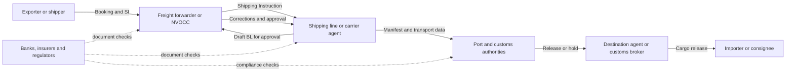
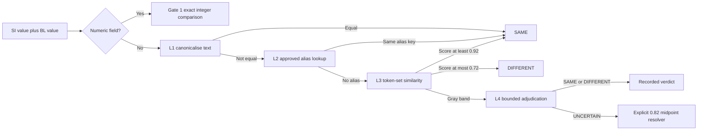

# SIBL - more than just verifying

> One step further, from document consistency to destination-aware

[Live demo](https://sibl-seven.vercel.app) | [Architecture notes](docs/architecture.md) | [Score history](docs/scores.md) | [Country-rule fixtures](demo-country-rules/)

---

## 1. Understanding the shipping ecosystem and workflow

An ocean shipment is not a single hand-off between a shipper and a shipping line. It is a chain of organisations, systems, deadlines and documents. In a typical Malaysian or regional operation, the exporter may prepare the cargo information, a freight forwarder may coordinate the booking, the shipping line issues the transport document, and destination agents and Customs manage clearance and release.



### How the shipping-document workflow operates

| Step | Main party | What happens | Where the risk appears |
|---|---|---|---|
| **1. Booking** | Exporter, shipper or freight forwarder | Cargo, route, equipment and sailing details are sent to the shipping line. | A wrong party, port or quantity can enter the job before documents are prepared. |
| **2. Shipping Instruction** | Shipper or forwarder documentation team | The SI states how the shipment should appear on the BL. It is the reference document for this project. | Different customer templates, abbreviations and missing destination information make manual checking difficult. |
| **3. Draft BL preparation** | Shipping line or carrier agent | The SI data is entered into the carrier system and a draft BL is returned for checking. | Re-keying, template conversion and interpretation can introduce a mismatch. |
| **4. Verification and amendment** | Shipper, forwarder and carrier documentation teams | Both sides review the draft, exchange corrections and approve it before the documentation cut-off. | Repeated email threads, short deadlines and unclear evidence can cause an error to be missed or corrected too late. |
| **5. Final BL and manifest** | Shipping line | The approved data becomes the final transport document and supports manifest submission. | A consistent SI and BL may still omit a field required by the destination country. |
| **6. Destination clearance** | Destination agent, customs broker, port and Customs | Local parties use the BL, manifest and supporting documents to clear and release the cargo. | A local rule failure may cause a hold, amendment, penalty, storage, demurrage or detention. |
| **7. Delivery and container return** | Consignee, haulier and depot | The consignee collects the cargo and returns the empty container within the allowed free time. | Every unresolved document issue can extend dwell time and increase charges. |

The SI therefore expresses what the shipper intends to move, whilst the draft BL shows how the shipping line has recorded it. The same information is then reused by forwarders, ports, Customs, banks, insurers and destination agents. A mistake near the beginning can propagate across several organisations before anyone notices it.

This project sits at two control points in that workflow:

1. **Before BL approval:** compare the draft BL against the SI and identify the exact field that needs correction.
2. **Before submission or destination processing:** check whether the SI contains the evidence required by the configured trade-lane rules.

It does not attempt to replace the booking, TMS, customs declaration or carrier platform. It acts as a verification layer between the email-and-attachment workflow used today and the structured digital exchange the industry is moving towards.

---

## 2. The problem

### 2.1 Problem given

The organiser's brief gives us a mixed shipping inbox containing document-comparison requests, new SI requests, invoice queries, operational updates and spam. The team must first identify which emails genuinely require checking. For each comparison request, the SI is the reference and the draft BL must be checked across seven fields: shipper, consignee, notify party, port of loading, port of discharge, container count and gross weight. The same field may appear under different labels, formats or layouts, and a missed discrepancy can lead to another amendment cycle, delayed approval and additional operational work.

The team must also distinguish a genuine mismatch from a reading problem. A missing attachment, unreadable scan or absent value should be sent for review, not reported as though the SI and BL contain different business information. Raising too many false alarms simply creates another queue for the same team to clear.

### 2.2 What we have researched

Our research shows that the given problem sits within a much larger industry-wide document flow:

- The [ICC Digital Standards Initiative](https://dsi.iccwbo.org/) describes global trade as still relying on more than 40 official and commercial documents. It estimates that replacing physical bills of lading with eBLs could save **US$6.5 billion** in direct documentation cost and unlock **US$30-40 billion** in trade growth. These figures describe document friction broadly; they are not presented here as losses caused only by country-rule errors.
- The [WTO](https://www.wto.org/english/tratop_e/tradfa_e/tradfa_overview_e.htm) identifies opaque, duplicated documentation and border delays as costs that can exceed tariffs. Its Trade Facilitation Agreement specifically calls for published import/export requirements, pre-arrival document processing and electronic submission.
- Since 1 January 2024, [IMO Member States have been required to operate Maritime Single Windows](https://www.imo.org/en/ourwork/facilitation/pages/maritimesinglewindow-default.aspx) for electronic information exchange during port calls. Digital exchange is becoming mandatory, but digitising incorrect data only moves the error faster.
- [DCSA's Booking 2.0 and Bill of Lading 3.0 standards](https://dcsa.org/newsroom/final-versions-of-booking-bill-of-lading-standards-released) are designed to reduce re-keying, errors and administrative cost. DCSA's ten carrier members represent about 75% of global container trade volume, making interoperability an important product direction rather than a theoretical one.
- [FIATA](https://fiata.org/digital-strategy/) similarly identifies inconsistent data quality and weak interoperability between freight forwarders, carriers and transport-management systems as an industry-wide problem.

We also found a risk beyond the given SI-versus-BL comparison. A draft BL can reproduce the SI perfectly whilst both documents omit information required by a destination country. For example, Maersk's [Indonesia manifest advisory](https://www.maersk.com/news/articles/2021/07/30/directorate-general-of-customs-and-excise) states that corporate shipper/consignee NPWP or Tax ID must be included in the Final SI and warns that incomplete data can cause failure to load or cargo remaining on board.

The financial impact is not limited to an amendment fee. Under Maersk's currently published [Indonesia import tariff](https://www.maersk.com/local-information/asia-pacific/indonesia/import), one delayed 40-foot dry container would accumulate about **US$1,150 by day 20** and **US$2,350 by day 30**, before terminal storage and other surcharges. This is an illustrative tariff calculation, not a claim that every missing field produces a 30-day delay.

Our inspection of the supplied dataset also showed why simple keyword matching is not dependable:

- all 13 PDF SIs are headed `BILL OF LADING INSTRUCTION`, which can be mistaken for a BL;
- 51 files contain CJK characters inside the gross-weight label;
- eight PDFs are unreadable, including corrupt and image-only files;
- 94 comparison requests carry no attachment, although only five genuinely report a missing attachment;
- container counts may appear in tables instead of labelled lines; and
- XLSX attachments appear in the data even though they are not prominent in the main brief.

### 2.3 How we frame the problem

We frame this as five connected decisions rather than a single text-comparison task:

| Decision | Question the system must answer | Unsafe shortcut to avoid |
|---|---|---|
| **Intent** | Does this email actually request an SI-versus-BL comparison? | Trusting the subject line or attachment count alone |
| **Readability** | Do we have the correct, readable documents and all required values? | Treating a reading failure as a business mismatch |
| **Consistency** | Does the draft BL reproduce the seven SI fields correctly? | Comparing raw text without understanding labels, names, tables or formats |
| **Compliance** | Is the SI ready for the configured destination requirements? | Assuming that matching documents are automatically acceptable |
| **Accountability** | Can an operator see the evidence and understand why the system decided? | Returning an unexplained model answer or silent failure |

The central distinction is:

Most document automation answers one question:

> **Consistency:** Does the draft BL reproduce the SI correctly?

Real operations require a second question:

> **Compliance:** Is the information acceptable for this carrier, route and destination?

These are different decisions. If both documents omit the same mandatory identifier, they are consistent but still non-compliant.

This framing defines the product: **route the right work, verify that the evidence is readable, catch transcription defects, expose destination-rule risk, and provide a traceable path to human review.**

---

## 3. Idea Overview

Our answer to this problem is to build an **intelligent and auditable shipping-document verification pipeline** that works with the emails and attachments already used by shipping documentation teams. The service identifies which emails require an SI-versus-BL check, reads both documents, extracts the seven critical shipment fields, and presents the values side by side. It automatically clears dependable matches, flags confirmed differences, and sends unreadable, incomplete or uncertain cases to a person with the relevant evidence instead of making a guess.

We then extend the solution beyond document matching. Using the same extracted shipment information, a separate rules engine checks whether the Shipping Instruction meets configured destination-country requirements before submission. This enables the service to identify both **document inconsistency** and **operational non-compliance**, whilst keeping the two decisions separate, traceable and easy to explain.

In short, the service answers two questions:

1. **Do the SI and draft BL match?**
2. **Is the Shipping Instruction & Bill of Lading ready for this destination?**

### Core feature: document verification

For each relevant email, compare the SI against the draft BL across seven fields:

1. `shipper`
2. `consignee`
3. `notify_party`
4. `port_of_loading`
5. `port_of_discharge`
6. `container_count`
7. `gross_weight_kg`

The result is one of:

- `OK` - all seven fields agree.
- `MISMATCH` - one or more fields are confirmed different.
- `NEEDS_REVIEW` - a dependable comparison cannot be completed because an attachment, document type, readable value or required field is missing.

### Bonus feature: country-aware compliance

After extraction, an independent rules engine infers the carrier, origin, destination and direction, then evaluates applicable rules against the SI. Its result is deliberately separate:

- `PASS` - every applicable requirement passed.
- `BLOCK` - a mandatory requirement failed.
- `NOT_APPLICABLE` - route context exists, but no configured rule applies.
- `NOT_CHECKED` - there is not enough route context to choose a rule safely.

This makes the most valuable demonstration possible:

```text
Document comparison: OK
Country compliance: BLOCK

Reason: Indonesia import requires evidence of a local consignee and a labelled NPWP/Tax ID.
Action: Correct the Shipping Instruction before submission.
```

Country compliance never turns a compliant `OK` comparison into a fake `MISMATCH`. It is a second operational decision, with its own source, evidence and recommended action.

### Current scope of the bonus layer

The prototype proves the architecture with reviewed Indonesia import/export party rules. It detects and displays a carrier, but the current seeded rules use carrier scope `*`; therefore, this version should be described as **country-aware**, not as comprehensive carrier-specific coverage. It is not a legal-advice system and does not claim global regulatory coverage.

---

## 4. Technical architecture

```mermaid
flowchart LR
    subgraph INPUT["1 · INPUT"]
        direction TB
        I1["Batch inbox<br/>520 JSON email records"]
        I2["Live email<br/>Browser upload"]
        I3["Attachments<br/>TXT · PDF · DOCX · XLSX"]
    end

    subgraph PIPELINE["2 · VERIFICATION PIPELINE"]
        direction LR
        S1["CLASSIFY<br/>Gemini + constrained schema"]
        S2["INGEST<br/>Format-specific readers"]
        S3["ROLE + GATES<br/>Detect SI/BL · validate input"]
        S4["EXTRACT<br/>Seven fields + source evidence"]

        S5["DOCUMENT CHECK<br/>Exact numbers · L1-L4 text ladder"]
        C1["CONTEXT<br/>Carrier · origin · destination"]
        C2["COUNTRY RULES<br/>Sourced · scoped · versioned"]

        S1 -->|BL comparison| S2 --> S3 --> S4
        S4 --> S5
        S4 --> C1 --> C2
    end

    subgraph OUTPUT["3 · DECISION OUTPUT"]
        direction TB
        D1["DOCUMENT RESULT<br/>OK · MISMATCH · NEEDS_REVIEW"]
        D2["COMPLIANCE RESULT<br/>PASS · BLOCK<br/>NOT_APPLICABLE · NOT_CHECKED"]
        E["EVIDENCE PACKAGE<br/>Values · snippets · deciding layer · action"]

        D1 --> E
        D2 --> E
    end

    subgraph APP["4 · WEB APPLICATION AND REVIEW"]
        direction TB
        API["FastAPI backend"]
        UI["Web dashboard<br/>Inbox · report · evidence · review"]
        H["Human decision<br/>Confirm or correct"]
        DB[("Alias snapshots<br/>Firestore or local fallback")]

        API --> UI --> H --> DB
    end

    I1 --> S1
    I2 --> S1
    I3 --> S2

    S1 -->|Other four categories| E
    S5 --> D1
    C2 --> D2
    E --> API
    DB -. approved aliases .-> S5

    classDef inputNode fill:#e8f1ff,stroke:#3b6ea8,color:#102a43;
    classDef pipelineNode fill:#eef8f2,stroke:#3c8c5a,color:#163c26;
    classDef outputNode fill:#fff5df,stroke:#b57a12,color:#4d3507;
    classDef appNode fill:#f3edff,stroke:#7551a8,color:#2d1d47;

    class I1,I2,I3 inputNode;
    class S1,S2,S3,S4,S5,C1,C2 pipelineNode;
    class D1,D2,E outputNode;
    class API,UI,H,DB appNode;
```



The layout follows the operational flow from left to right. Document comparison and country compliance branch only after the same evidence-backed extraction stage, then return separate decisions to one evidence package. The only feedback line is the dotted human-review path, where approved aliases can support a future comparison without bypassing the deterministic checks.

### Pipeline overview

| Stage | What happens | Failure behaviour |
|---|---|---|
| **S1 - Classify** | Gemini classifies batched emails as `BL_COMPARISON`, `SI_REQUEST`, `INVOICE_QUERY`, `GENERAL` or `SPAM`. Only comparisons continue. | Schema-constrained output prevents invalid categories. Missing credentials or exhausted retries produce a visible degraded path, not a fabricated result. |
| **S2 - Ingest** | Format-specific handlers convert TXT, PDF, DOCX and XLSX into a common `DocText` representation. | Corrupt and image-only files carry an error state. |
| **S3 - Role and pre-gates** | Headers identify SI versus BL independently of filename and upload order. Gates detect `missing_attachment`, `wrong_doc_type` and `unreadable`. | Reading problems go to `NEEDS_REVIEW`; they are never reported as business mismatches. |
| **S4 - Extract** | Label maps, line/block layouts and table/numeric parsers extract the seven fields. An LLM fallback may fill only fields the parser missed. | Missing values become `missing_value`; conflicting numeric sources trigger review. |
| **S5 - Compare** | Exact numeric comparison, canonicalisation, alias lookup, similarity bands and narrow LLM adjudication determine `SAME`, `DIFFERENT` or `MISSING`. | An uncertain LLM response is resolved by an explicit threshold policy and recorded. |
| **S6 - Roll up** | Any confirmed difference produces `MISMATCH`; otherwise gate defects produce `NEEDS_REVIEW`; otherwise the result is `OK`. | Precedence is deterministic and testable. |
| **S7 - Explain and emit** | Produce the submission JSON, evidence trace, web report and review context. | Every output retains its deciding layer and source values. |
| **C1-C3 - Compliance** | Infer shipment context and evaluate applicable versioned country rules against the SI. | Missing context becomes `NOT_CHECKED`; no applicable rule becomes `NOT_APPLICABLE`. |

### Runtime and deployment

| Component | Technology | Role |
|---|---|---|
| Language | Python | Pipeline and services |
| AI | Gemini 3.5 Flash-Lite via `google-genai` | Email intent, missing-field fallback, optional gray-band adjudication |
| Document parsing | PyMuPDF, python-docx, openpyxl | PDF, DOCX and XLSX ingestion |
| Web application | FastAPI + static HTML/CSS/JS | APIs and the demo workflow |
| State | Firestore with local JSON fallback | Review decisions and alias candidates |
| Hosting | Vercel live; Cloud Run configuration ready | Serverless deployment |
| Quality | pytest | Unit and integration tests |

---

## 5. Implementation details

### 5.1 Format-independent ingestion

Every attachment becomes `DocText`: normalised lines, original format, path and an optional error. Downstream extraction therefore does not need separate business logic for every file type. The loader supports formats discovered in the actual data, including XLSX even though it was not prominent in the original problem description.

### 5.2 Document roles are detected, not trusted

Filenames and upload order are not treated as truth. Roles come from the document header, with `INSTRUCTION` tested before `BILL OF LADING`. This matters because all 13 PDF SIs in the corpus use the heading `BILL OF LADING INSTRUCTION`; a naive substring test would classify them as BLs.

### 5.3 Deterministic field extraction first

Observed label variants such as `POL`, `Port of Loading (POL)` and `Load Port` map to the same canonical field. Both linear `Label: value` and block `Label\nvalue` layouts run, while dedicated numeric logic reads summary lines and tables.

Container count and gross weight can appear twice: once in a summary and once in a container table. The system cross-checks the independent sources. A disagreement is evidence that extraction is unreliable, so it produces review rather than a false mismatch.

### 5.4 The comparison ladder



Parties compare on company name before address. This prevents two different companies at the same address from appearing similar enough to pass. Ports receive port-specific canonicalisation. Numeric fields never go to a model.

### 5.5 Evidence and human review

Each field verdict stores:

- SI value and BL value;
- `SAME`, `DIFFERENT` or `MISSING`;
- deciding layer (`gate1`, `L1`, `L2`, `L3`, `L4` or resolver);
- similarity score where relevant;
- source snippet and reason.

Review decisions are written as pending alias evidence. Promotion is controlled rather than immediate: scored runs pin an immutable alias snapshot, low-similarity LLM agreements are not promoted, and any human `DIFFERENT` decision blocks or removes the link. This lets the system learn without making past results irreproducible.

### 5.6 Country-rule engine

Rules live in [`src/sdoc/rules/country_rules.json`](src/sdoc/rules/country_rules.json), separate from comparison logic. A rule carries:

- stable rule ID;
- country and import/export direction;
- carrier scope;
- effective date;
- source URL and source-check date;
- field and requirement type;
- severity, explanation and corrective action.

The engine uses explicit evidence. A party is considered Indonesian only when its block contains recognised country or location evidence; a company suffix is not enough. A tax identifier is accepted only when labelled `NPWP`, `Tax ID` or `TIN`, preventing a phone or registration number from being silently treated as tax evidence.

### 5.7 Why not let the LLM do everything?

LLMs are useful, but their weaknesses line up badly with shipping operations:

| LLM limitation | Operational risk | How this system contains it |
|---|---|---|
| Hallucination or inference beyond the document | Invented party, weight, tax ID or rule could release the wrong shipment | The fallback is instructed to copy values only. Numeric values are reparsed by code. Country rules are curated JSON, not generated answers. |
| Non-determinism | The same shipment could receive different decisions on different runs | Deterministic extraction and comparison settle the majority of fields. Prompts are content-hash cached and scored runs pin alias snapshots. |
| Weak arithmetic and exactness | A plausible but wrong container total or weight can be costly | Counts and weights are parsed, summed, cross-checked and compared exactly in code. |
| Malformed or out-of-domain output | Broken JSON or invented categories can disrupt a batch | Classification uses schema-constrained decoding with a five-value enum. |
| Rate limits, latency and outages | A queue could stop during a deadline or live demo | Calls are batched, throttled, cached and retried using provider hints. The live document comparison is deterministic and remains available without the model. |
| Unclear confidence | A fluent explanation can hide uncertainty | The LLM is only allowed to adjudicate a narrow similarity gray band and may return `UNCERTAIN`; evidence and deciding layer remain visible. |
| Stale regulatory knowledge | A model may quote an obsolete destination rule | Policy comes from versioned, source-linked rules with effective and source-check dates. Unknown context is `NOT_CHECKED`, never guessed. |

This does not “solve” every LLM limitation. It changes the architecture so that a model failure is bounded, visible and recoverable. On the current scored dataset, the L4 adjudicator fired **zero times**; that is reported as evidence that deterministic layers handled the comparisons, not hidden as an AI success.

### 5.8 Caching and failure visibility

Every Gemini prompt is keyed by `SHA256(model + prompt)`. Re-running comparison logic therefore does not repay unchanged model calls. The client honours rate-limit retry hints and uses bounded backoff. If the API key is absent or too few emails are routed as comparisons, the batch script prints a loud warning so a degraded run is not mistaken for a model-quality result.

---

## 6. Challenges faced

1. **A misleading SI header.** `BILL OF LADING INSTRUCTION` contains the BL phrase but is still an SI. Header precedence fixed all readable examples.
2. **Messy multilingual labels.** Fifty-one files contain CJK characters inside the gross-weight label, and some PDFs extract missing glyphs as `II`. Normalisation had to tolerate parser noise without accepting arbitrary text.
3. **Values hidden in tables.** Container counts are often implicit in row structure rather than written on a labelled line. A table reader and summary cross-check were required.
4. **An undocumented format.** XLSX attachments would have been a silent coverage hole without inspecting the real bundle and loader behaviour.
5. **Unreadable is not mismatched.** Two corrupt and six image-only PDFs must be escalated. Treating them as different would inflate defect counts and erode trust.
6. **Attachment count is not intent.** Ninety-four comparison requests have no attachment, but only five genuinely claim that an attachment was lost. The email body, not the count, decides the missing-attachment gate.
7. **Addresses can create false similarity.** Two different parties may share an address. Party-name-first comparison prevents the address from overpowering the identity signal.
8. **Learning can destroy reproducibility.** A mutable alias table changes future answers. Pending decisions plus pinned snapshots preserve attributable A/B tests.
9. **Regulation changes over time.** A compliance rule without provenance becomes a new source of risk. Rule IDs, scope, dates, URLs and tests make review possible.
10. **Cloud failure must degrade safely.** The UI and deterministic comparison cannot depend on a successful model call or writable serverless filesystem.

---

## 7. Results and metrics

The organiser's local `POST /submit` endpoint scored the output against a private reference set. The answer key was never read; only aggregate metrics were returned.

| Axis | Weight | Result |
|---|---:|---:|
| End-to-end defect catching | 50% | **0.978** - 45 of 46 defects caught |
| Stage-3 defect F1 | 20% | **0.989** - precision 1.00 |
| Stage-1 classification macro-F1 | 30% | **0.955** |
| **Final score** | | **0.9734** |

Reliability is reported separately at **0.947**, with escalation precision **1.00**. By reason, the run caught `wrong_doc_type` 5/5, `missing_attachment` 5/5, `unreadable` 5/5 and `missing_value` 3/5.

### Run composition

| Category or outcome | Count |
|---|---:|
| Total emails | 520 |
| `BL_COMPARISON` | 195 |
| `SI_REQUEST` | 129 |
| `INVOICE_QUERY` | 75 |
| `GENERAL` | 81 |
| `SPAM` | 40 |
| Confirmed mismatches | 47 |
| Human-review cases | 18 |

### Progression

```text
0.0124  baseline: everything GENERAL
0.7465  deterministic document pipeline plus heuristic routing
0.9734  Gemini classification plus schema-constrained output
```

The key result is not that an LLM scored well by itself. The deterministic pipeline already caught 45 of 46 defects with no false-positive defects; Gemini contributed most strongly by routing the right emails into that pipeline.

### Extraction coverage and measured generalisation risk

Deterministic extraction reached approximately **98% field coverage** on readable attachments. That number is corpus-specific, so the project also removes random shares of known label spellings and reruns extraction:

| Known label spellings withheld | Field coverage |
|---:|---:|
| 0% | 0.980 |
| 10% | 0.907 |
| 25% | 0.722 |
| 40% | 0.653 |
| 50% | 0.541 |

Removing half the lexicon reduces coverage by about 44%. This is an acknowledged onboarding cost, not hidden behind the in-corpus score. A new customer therefore needs a shadow-mode learning period and label-coverage report before automation is trusted.

### Test status

```text
237 passed, 5 skipped in 2.07s
```

The skipped tests require organiser data that is not committed to the repository. The suite covers ingestion, extraction, comparison, gates, country rules, review persistence, APIs and web pages.

---

## 8. Current limitations

- **Country coverage is narrow.** Only the seeded Indonesia import/export party requirements are implemented. A green compliance result means the configured rules passed, not that every law, commodity restriction, sanction or customs requirement was checked.
- **Rules require governance.** Sources can change. A production service needs an owner, review cadence, effective-date handling and withdrawal procedure for every rule pack.
- **Scanned PDFs are escalated, not OCR-ed.** This is safe but leaves six image-only samples unresolved.
- **The label lexicon is corpus-shaped.** The holdout experiment shows that performance falls on unfamiliar templates.
- **Classification still depends on an external model for the best score.** Caching and fallbacks preserve availability, but a degraded classifier reduces recall.
- **L4 is implemented but not exercised by this dataset.** No claim is made that model adjudication improved the recorded comparison score.
- **Firestore is implemented but not active on the public deployment** without service-account credentials; local JSON remains the fallback.
- **There is no live mailbox or TMS connection yet.** The prototype starts from JSON records or browser uploads.
- **Compliance is decision support, not legal advice.** A customer remains responsible for regulatory interpretation and final submission.

---

## 9. Future roadmap: technical and business growth

The roadmap develops two tracks in parallel. The technical track turns the prototype into a secure, measurable and integration-ready service. The business track validates value with documentation teams, develops governed trade-lane coverage and converts successful pilots into long-term customers.

### 9.1 Technical roadmap

The technical direction is not simply to use a larger model. Each release should reduce uncertainty, make failure more visible and preserve the deterministic controls that produced the current results.

#### If we proceed to the final round: 3-day technical sprint

The first priority is to protect the working `0.9734` baseline. Final-round features will be isolated behind feature flags and merged only after the existing regression suite and scoring flow still pass. The three days will be used as follows:

| Time | Engineering focus | Deliverable and acceptance gate |
|---|---|---|
| **Day 1 - Freeze and harden the core** | Tag the scored pipeline; reproduce the full run; add a one-command regression check; validate environment variables and secret handling; improve structured logs for classification, extraction, gates, comparison and compliance; add automatic schema validation for `country_rules.json`. | A clean deployment that reproduces the existing metrics, passes all tests, exposes no secret in the repository, and shows a clear reason whenever processing is degraded. |
| **Day 2 - Strengthen the differentiator** | Add evidence-preserving OCR/vision handling for image-only PDFs, but keep low-confidence values in `NEEDS_REVIEW`; improve the compliance panel so rule source, effective date, evidence and corrective action are visible; add one additional country or trade-lane rule pack only if it can be sourced, reviewed and regression-tested within the sprint. | The original Indonesia `BLOCK` and `PASS` scenarios remain reproducible. At least one scanned example produces visible source evidence or a safe review outcome, never an unsupported automatic match. Any new rule ships with provenance and tests. |
| **Day 3 - Make it integration- and demo-ready** | Add a small mailbox-ingestion proof of concept or documented webhook contract; measure latency and model calls on the 520-email run; polish the Inbox, Report, Evidence and Review views; prepare a seeded offline demo and failure fallback for unstable network or model quota. | A judge can run the main workflow end to end, understand both decisions, inspect the evidence, complete a review action and see the system continue safely when the external model is unavailable. |

The final-round definition of done is deliberately narrow:

- no regression below the current held-out score without an explained trade-off;
- the existing automated test suite remains green;
- document comparison and country compliance remain separate results;
- every new rule has a source, scope, effective date and regression test;
- OCR or LLM output cannot bypass evidence and human-review gates;
- the live demo has a tested offline or deterministic fallback; and
- performance, model-call count and known limitations are reported honestly.

If time becomes limited, the priority order is **baseline reliability -> evidence and review -> compliance demonstration -> integration proof of concept -> additional coverage**. We will not add a broad but unverified rule library merely to make the feature list longer.

#### Longer-term technical roadmap

| Horizon | Technical work | Intended outcome |
|---|---|---|
| **0-3 months: strengthen the core** | Add OCR and vision extraction behind the existing readability gates; show the source region for every extracted value; introduce field-level confidence; detect unseen templates; validate the country-rule JSON schema automatically. | Read more scanned documents without silently promoting uncertain OCR text to truth. |
| **3-6 months: integration and tenancy** | Add Microsoft 365/Exchange and Gmail connectors, TMS webhooks and REST APIs; support DCSA-aligned SI and transport-document payloads; implement tenant isolation, role-based access, configurable retention and encrypted secret storage. | Fit into a customer's current workflow without creating another inbox or mixing customer data. |
| **6-12 months: evaluation and rule operations** | Version models, prompts, label packs and rules together; build offline regression sets per customer and trade lane; calibrate thresholds by field; monitor drift, review rate and unseen labels; add rule expiry alerts, approval history and rollback. | Make every release measurable and every compliance-rule change governed and reversible. |
| **9-18 months: broader document graph** | Reconcile commercial invoices, packing lists, certificates of origin and dangerous-goods declarations with SI/BL data; add multilingual labels and customer-specific templates; expose a shared canonical shipment record. | Detect inconsistencies across the shipment file, not only between two documents. |
| **12-24 months: enterprise reliability** | Introduce asynchronous job queues, idempotent processing, workload isolation, structured observability, disaster recovery, regional deployment and service-level monitoring; prepare for SOC 2 and ISO 27001 assessments. | Support higher volumes and enterprise procurement with predictable recovery, security and auditability. |

Technical progress will be measured using field coverage, defect recall, false-alarm rate, review rate, calibration error, processing latency, cost per shipment and time to recover from a failed dependency. A new model or parser will only be promoted when it improves the relevant acceptance set without weakening evidence quality.

### 9.2 Business adoption roadmap

#### Phase 1 - Design Partner Programme (0-3 months)

Recruit three to five design partners from the people who already carry the documentation burden:

- regional freight forwarders and NVOCCs;
- exporter/importer documentation teams;
- customs brokers and destination agents;
- carrier agencies handling repeated SI amendments.

Offer a time-boxed **Lane Risk Audit** and an 8-12 week shadow-mode pilot. The service reads copied mail or exported job folders but does not block submissions. For each partner it measures:

- manual minutes per document pair;
- mismatch escape rate;
- false-alarm and review rate;
- amendment cycles before BL approval;
- document-related holds and demurrage/detention exposure;
- field labels and formats not covered by the current lexicon.

The conversion path is concrete:

```text
Free lane audit -> paid shadow pilot -> production subscription -> more branches and trade lanes
```

A partner receives an ROI report and a private rule/label pack; the project receives anonymised edge cases, subject to data agreements.

#### Phase 2 - Corridor Packs and Rule Governance (3-6 months)

Build sellable **Trade Lane Packs**, beginning with lanes relevant to Southeast Asian operators, for example Malaysia-Indonesia and Singapore-Indonesia. Each pack combines:

- customer and carrier templates;
- port and country aliases;
- sourced destination requirements;
- rule effective dates and regression tests;
- an exception playbook and reviewer contact;
- monthly source review and urgent-rule withdrawal workflow.

Create a small Rules Council involving a customs broker, carrier-domain specialist and customer compliance owner. The product team maintains executable rules; domain partners approve meaning and effective dates. Customers can subscribe only to the corridors they use, keeping scope understandable and reviewable.

#### Phase 3 - Integration instead of another inbox (3-9 months)

Meet operators inside their existing tools:

- Microsoft 365/Exchange and Gmail ingestion;
- webhook and REST API for TMS/ERP vendors;
- DCSA Bill of Lading 3.0-aligned SI/transport-document payloads;
- FIATA eFBL-compatible export and verification paths;
- SSO, role-based access, tenant isolation and configurable retention;
- event callbacks for `MISMATCH`, `NEEDS_REVIEW` and `BLOCK`.

The long-term product should be an embedded verification service, not a dashboard staff must remember to visit.

#### Phase 4 - Commercial model and customer acquisition (6-12 months)

Package the service for different buyers:

| Customer | Initial offer | Value proof |
|---|---|---|
| Freight forwarder / NVOCC | Per-shipment verification plus reviewer seats | Fewer corrections, faster BL approval, auditable customer service |
| Exporter / importer | Pre-submission lane pack | Prevent errors before sending SI to forwarder/carrier |
| Carrier agency | API validation at SI intake | Fewer rejected SIs and amendment cycles |
| Customs broker | White-labelled destination-rule review | Earlier exception detection and higher-value advisory service |
| TMS provider | Embedded API / revenue-share module | New capability without building document intelligence in-house |

Go-to-market programmes:

1. **Forwarder association workshops.** Run anonymised “find the defect” clinics with national logistics and forwarding associations, then offer participating firms a lane audit.
2. **Carrier and broker rule partnerships.** Give domain partners a governed portal to propose and approve rule updates; share qualified leads for supported corridors.
3. **TMS integration partnerships.** Provide a sandbox, sample payloads and a co-marketing pack so existing software vendors become distribution channels.
4. **Outcome-based pilots.** Define success before deployment and publish partner-approved case studies using time saved, defect escape reduction and avoided amendment cycles - not vague AI productivity claims.
5. **Land and expand.** Start with one branch and one high-volume lane, then add users, formats, countries and business units after acceptance thresholds are met.

Pricing can combine a platform fee, reviewer seats and volume tiers. High-volume customers receive private deployment or regional data residency. A limited outcome-based component can be tested during pilots, but “avoided demurrage” should only be claimed when the customer supplies attributable evidence.

#### Phase 5 - Production trust and broader coverage (6-18 months)

- OCR plus vision extraction with the same evidence gates; never promote OCR text directly to truth without confidence and source-region display.
- Confidence calibration by field, template and customer rather than one global threshold.
- Dual review for high-severity compliance changes.
- Rule-source monitoring, expiry alerts and signed rule releases.
- Full audit export for customer QA and customs enquiries.
- Encryption, secrets management, regional storage, deletion controls and an SOC 2 / ISO 27001 readiness programme for enterprise procurement.
- Monitoring for drift in categories, missing fields, review rate and unseen labels.
- Support for commercial invoices, packing lists, certificates of origin and dangerous-goods declarations after the SI/BL workflow is stable.

#### Phase 6 - Network strategy (12-24 months)

The defensible asset is not a generic model. It is a governed network of:

- customer-approved label and template packs;
- carrier and corridor rules with provenance;
- confirmed aliases and exception patterns;
- interoperable APIs based on industry standards;
- outcome data showing where document friction occurs.

The goal is to become the verification layer between email-era operations and the industry's emerging digital standards: usable today with messy attachments, but ready to exchange structured SI and BL data tomorrow.

---

## 10. Running the project

```powershell
git clone <repository-url>
cd SIBL

python -m venv .venv
.venv\Scripts\Activate.ps1
pip install -r requirements.txt

# Put the organiser bundle in data/ and use a fresh local secret.
$env:GEMINI_API_KEY="your-key"
$env:PYTHONPATH="src"

python -m pytest -q --basetemp=.cache/pytest
python scripts/run.py
python scripts/run.py http://localhost:8080
python -m uvicorn web.app:app --port 8000
```

Open `http://127.0.0.1:8000`. The inbox pages serve the precomputed `run.json`; **Try an email** and live uploads execute the real pipeline.

Never commit `.env`, organiser data, cached model output or service-account credentials.

---

## 11. Repository map

```text
src/sdoc/
  classify.py             Email classification
  docs/                   TXT, PDF, DOCX and XLSX ingestion
  extract/                Label, layout, numeric and fallback extraction
  compare/                Canonicalisation, aliases, similarity and adjudication
  gates.py                Missing, wrong-type and unreadable gates
  shipment_context.py     Carrier and route inference
  country_rules.py        Deterministic compliance evaluation
  rules/country_rules.json
  pipeline.py             End-to-end orchestration
  firestore_store.py      Review persistence with local fallback
web/
  app.py                  FastAPI API and demo server
  static/                 Browser UI
tests/                    Unit and integration coverage
docs/                     Architecture, scores and demo material
demo-country-rules/       Reproducible BLOCK and PASS examples
```

---

## 12. Research references

- Averis Hackathon 2026 organiser problem statement - core brief: classify, extract, compare and escalate.
- [WTO Trade Facilitation Agreement](https://www.wto.org/english/docs_e/legal_e/tfa_e.htm) - publication of import/export procedures and pre-arrival electronic documentation.
- [WTO overview of trade-facilitation friction](https://www.wto.org/english/tratop_e/tradfa_e/tradfa_overview_e.htm) - border delays and opaque or redundant documentation.
- [ICC Digital Standards Initiative](https://dsi.iccwbo.org/) - trade-document fragmentation, eBL adoption and economic estimates.
- [IMO Maritime Single Window](https://www.imo.org/en/ourwork/facilitation/pages/maritimesinglewindow-default.aspx) - mandatory electronic port information exchange since 2024.
- [DCSA Booking 2.0 and Bill of Lading 3.0](https://dcsa.org/newsroom/final-versions-of-booking-bill-of-lading-standards-released) - interoperable booking and BL standards.
- [DCSA eBL technical implementation guide](https://reference.dcsa.org/content/standards/guidelines/implementation-guides/ebl-technical-implementation-guidelines) - SI submission, validation and transport-document workflow.
- [FIATA digital strategy](https://fiata.org/digital-strategy/) and [digital FBL](https://www.efbl.fiata.org/) - freight-forwarder interoperability and secure digital documents.
- [Maersk Indonesia manifest advisory](https://www.maersk.com/news/articles/2021/07/30/directorate-general-of-customs-and-excise) - NPWP/Tax ID requirement and operational consequences.
- [Maersk Indonesia import information](https://www.maersk.com/local-information/asia-pacific/indonesia/import) - published demurrage and detention tariff used for the illustrative calculation.
- [Singapore Customs import procedures](https://www.customs.gov.sg/doing-business/import-operations/import-procedures/import-procedures-overview/) - examples of incorrect declarations, missing trade documents and penalties.

Research links and rule sources were last reviewed for this document on **21 September 2026**. Regulatory sources must be revalidated before production use.

---

## Project status

This is a hackathon prototype with a high-scoring, tested document-verification core and a deliberately narrow compliance proof of concept. It demonstrates the architecture and commercial direction; it is not yet a substitute for a carrier's documentation team, a customs broker or legal review.
